# Event Katalog - Dagpenger System

Dette dokumentet inneholder en oversikt over alle viktige events i dagpengesystemet.

## Event-struktur

Alle events i systemet følger Rapid & Rivers-mønsteret og sendes via Kafka.

### Standardfelter
Alle events har følgende felter:
- `@event_name` - Navn på eventen
- `@id` - Unik ID for meldingen (UUID)
- `@opprettet` - Tidspunkt for opprettelse (ISO 8601)
- `@behovId` - UUID for behovet (hvis relevant)

## Søknad Events

### søknad_innsendt_varsel
**Produsent:** `dp-soknad`  
**Konsument:** Varslingstjenester

**Beskrivelse:** Sendes når bruker sender inn søknad

**Felter:**
- `søknadId` (UUID) - Søknadens ID
- `søknadstidspunkt` (DateTime) - Når søknaden ble sendt
- `søknadData` (JSON) - Søknadens data
- `ident` (String) - Brukerens fødselsnummer

**Fil:** `dp-soknad/mediator/src/main/kotlin/no/nav/dagpenger/soknad/observers/SøknadInnsendtObserver.kt`

---

### søknad_slettet
**Produsent:** `dp-soknad`  
**Konsument:** Oppryddingstjenester

**Beskrivelse:** Sendes når bruker sletter en påbegynt søknad

**Felter:**
- `søknadId` (UUID)
- `ident` (String)
- `tidspunkt` (DateTime)

**Fil:** `dp-soknad/mediator/src/main/kotlin/no/nav/dagpenger/soknad/observers/SøknadTilstandObserver.kt`

---

### dokumentkrav_innsendt
**Produsent:** `dp-soknad`  
**Konsument:** Ettersendingstjenester

**Beskrivelse:** Sendes når bruker sender inn dokumentasjon (ettersending)

**Felter:**
- `søknadId` (UUID)
- `dokumentkrav` (Array)
- `ident` (String)

**Fil:** `dp-soknad/mediator/src/main/kotlin/no/nav/dagpenger/soknad/observers/SøknadTilstandObserver.kt`

---

## Innsending Events

### innsending_ferdigstilt
**Produsent:** `dp-behov-journalforing` (via dp-mottak)  
**Konsument:** `dp-soknad`, `dp-behandling`

**Beskrivelse:** Sendes når søknad er journalført i Joark

**Felter:**
- `fødselsnummer` (String)
- `journalpostId` (String)
- `søknadsData.søknad_uuid` (UUID)
- `type` (String) - NySøknad, Ettersending, Gjenopptak, Generell
- `fagsakId` (Int) - Arena fagsakId (hvis tilgjengelig)

**Konsumenter:**
- `dp-soknad` - Oppdaterer søknad med journalpostId
  - **Fil:** `dp-soknad/mediator/src/main/kotlin/no/nav/dagpenger/soknad/innsending/tjenester/JournalførtMottak.kt`
- `dp-behandling` - Starter behandling
  - **Fil:** `dp-behandling/mediator/src/main/kotlin/no/nav/dagpenger/behandling/mediator/mottak/InnsendingFerdigstiltMottak.kt`

---

### innsending_tilstand_endret
**Produsent:** `dp-soknad`  
**Konsument:** Overvåkning, metrikker

**Beskrivelse:** Sendes når innsendingstilstand endres

**Felter:**
- `søknadId` (UUID)
- `tilstand` (String)
- `forrigeTilstand` (String)

**Fil:** `dp-soknad/mediator/src/main/kotlin/no/nav/dagpenger/soknad/observers/InnsendingTilstandObserver.kt`

---

## Behandling Events

### søknad_behandlingsklar
**Produsent:** `dp-behandling`  
**Konsument:** `dp-behandling` (intern routing)

**Beskrivelse:** Transformert fra innsending_ferdigstilt, indikerer at behandling kan starte

**Felter:**
- `ident` (String)
- `søknadId` (UUID)
- `fagsakId` (Int)
- `innsendt` (DateTime)
- `journalpostId` (Int)
- `type` (String)

**Produsent fil:** `dp-behandling/mediator/src/main/kotlin/no/nav/dagpenger/behandling/mediator/mottak/InnsendingFerdigstiltMottak.kt`

**Konsument fil:** `dp-behandling/mediator/src/main/kotlin/no/nav/dagpenger/behandling/mediator/mottak/SøknadInnsendtMottak.kt`

---

### opprett_behandling
**Produsent:** Eksterne systemer / manuell trigger  
**Konsument:** `dp-behandling`

**Beskrivelse:** Trigger for å opprette ny behandling

**Felter:**
- `ident` (String)
- `behandlingType` (String)
- `årsak` (String)

**Fil:** `dp-behandling/mediator/src/main/kotlin/no/nav/dagpenger/behandling/mediator/mottak/OpprettBehandlingMottak.kt`

---

### godkjenn_behandling
**Produsent:** `dp-saksbehandling`  
**Konsument:** `dp-behandling`

**Beskrivelse:** Saksbehandler har godkjent behandling

**Felter:**
- `behandlingId` (UUID)
- `saksbehandlerIdent` (String)
- `godkjentTidspunkt` (DateTime)

**Fil:** `dp-behandling/mediator/src/main/kotlin/no/nav/dagpenger/behandling/mediator/mottak/GodkjennBehandlingMottak.kt`

---

### avbryt_behandling
**Produsent:** `dp-saksbehandling` eller automatiske prosesser  
**Konsument:** `dp-behandling`

**Beskrivelse:** Behandling skal avbrytes

**Felter:**
- `behandlingId` (UUID)
- `årsak` (String)

**Fil:** `dp-behandling/mediator/src/main/kotlin/no/nav/dagpenger/behandling/mediator/mottak/AvbrytBehandlingMottak.kt`

---

### rekjør_behandling
**Produsent:** Admin-verktøy eller automatiske prosesser  
**Konsument:** `dp-behandling`

**Beskrivelse:** Behandling skal kjøres på nytt

**Felter:**
- `behandlingId` (UUID)

**Fil:** `dp-behandling/mediator/src/main/kotlin/no/nav/dagpenger/behandling/mediator/mottak/RekjørBehandlingMottak.kt`

---

### vedtak_fattet
**Produsent:** `dp-behandling`  
**Konsument:** `dp-iverksett`, `dp-melding-om-vedtak`, statistikk

**Beskrivelse:** Vedtak er fattet og klar for iverksettelse

**Felter:**
- `behandlingId` (UUID)
- `vedtakId` (UUID)
- `ident` (String)
- `vedtakstidspunkt` (DateTime)
- `resultat` (String) - Innvilget, Avslått, etc.
- `sats` (Int) - Dagpengesats
- `periode` (Object) - Fra/til datoer

**Fil:** `dp-behandling/mediator/src/main/kotlin/no/nav/dagpenger/behandling/mediator/mottak/VedtakFattetMottak.kt`

---

## Saksbehandling Events

### oppgave_sendt_til_kontroll
**Produsent:** `dp-saksbehandling`  
**Konsument:** `dp-behandling`

**Beskrivelse:** Oppgave er sendt til kontroll (4-øyne prinsipp)

**Felter:**
- `oppgaveId` (UUID)
- `behandlingId` (UUID)
- `saksbehandlerIdent` (String)

**Fil:** `dp-behandling/mediator/src/main/kotlin/no/nav/dagpenger/behandling/mediator/mottak/OppgaveSendtTilKontroll.kt`

---

### oppgave_returnert_til_saksbehandling
**Produsent:** `dp-saksbehandling`  
**Konsument:** `dp-behandling`

**Beskrivelse:** Oppgave er returnert fra kontroll til saksbehandler

**Felter:**
- `oppgaveId` (UUID)
- `behandlingId` (UUID)
- `årsak` (String)

**Fil:** `dp-behandling/mediator/src/main/kotlin/no/nav/dagpenger/behandling/mediator/mottak/OppgaveReturnertTilSaksbehandler.kt`

---

## Meldekort / Rapportering Events

### beregn_meldekort
**Produsent:** Eksterne systemer (Arena-adapter, rapporteringstjeneste)  
**Konsument:** `dp-behandling`

**Beskrivelse:** Trigger beregning av meldekort/rapportering

**Felter:**
- `ident` (String)
- `periodeId` (Long)
- `aktiviteter` (Array)
- `dager` (Array)

**Fil:** `dp-behandling/mediator/src/main/kotlin/no/nav/dagpenger/behandling/mediator/mottak/BeregnMeldekortMottak.kt`

---

### meldekort_innsendt
**Produsent:** `dp-rapportering`  
**Konsument:** `dp-behandling`

**Beskrivelse:** Bruker har sendt inn meldekort/rapportering

**Felter:**
- `ident` (String)
- `meldekortId` (UUID)
- `periode` (Object)
- `rapporteringData` (JSON)

**Fil:** `dp-behandling/mediator/src/main/kotlin/no/nav/dagpenger/behandling/mediator/mottak/MeldekortInnsendtMottak.kt`

---

### rapportering_journalført
**Produsent:** `dp-behov-journalforing`  
**Konsument:** `dp-rapportering`

**Beskrivelse:** Rapporteringsperiode er journalført

**Felter:**
- `rapporteringsperiodeId` (Long)
- `journalpostId` (String)
- `ident` (String)

**Fil:** `dp-rapportering/src/main/kotlin/no/nav/dagpenger/rapportering/tjenester/RapporteringJournalførtMottak.kt`

---

## Behov (Requests for data)

### behov
**@event_name:** `behov`  
**Identifikator:** `@behov` array

Behov-eventer er spesielle i at de ber om data fra andre tjenester.

#### NySøknad
**Beskrivelse:** Ber om søknadsmal  
**Produsent:** `dp-soknad`  
**Løser:** `dp-quiz` (eller lignende maltjeneste)

**Felter:**
- `@behov: ["NySøknad"]`
- `søknad_uuid` (UUID)
- `ident` (String)
- `språk` (String)
- `prosesstype` (String)

**Løsning returnerer:**
- `@løsning.NySøknad.prosessversjon` (Object)

---

#### NyInnsending
**Beskrivelse:** Ber om journalføring av innsending  
**Produsent:** `dp-soknad`  
**Løser:** `dp-mottak` → `dp-behov-journalforing`

**Felter:**
- `@behov: ["NyInnsending"]`
- `søknadId` (UUID)
- `ident` (String)

---

#### Inntekt
**Beskrivelse:** Ber om inntektsopplysninger  
**Produsent:** `dp-behandling`  
**Løser:** `dp-inntekt`

**Felter:**
- `@behov: ["Inntekt"]`
- `behandlingId` (UUID)
- `ident` (String)
- `beregningsdato` (Date)

---

## Opplysninger

### opplysning_svar
**Produsent:** `dp-behandling`  
**Konsument:** Regelmotor, statistikk

**Beskrivelse:** Svar på opplysningsbehov (ofte fra saksbehandler)

**Felter:**
- `behandlingId` (UUID)
- `opplysningId` (UUID)
- `svar` (Any) - Kan være ulike typer
- `kilde` (String) - Saksbehandler, System, etc.

**Fil:** `dp-behandling/mediator/src/main/kotlin/no/nav/dagpenger/behandling/mediator/mottak/OpplysningSvarMottak.kt`

---

## Avklaring Events

### AvklaringIkkeRelevant
**Produsent:** `dp-saksbehandling` eller automatisk  
**Konsument:** `dp-behandling`

**Beskrivelse:** En avklaring er ikke lenger relevant

**Felter:**
- `behandlingId` (UUID)
- `avklaringId` (UUID)

**Fil:** `dp-behandling/mediator/src/main/kotlin/no/nav/dagpenger/behandling/mediator/mottak/AvklaringIkkeRelevantMottak.kt`

---

## Arena Events

### arena_oppgave
**Produsent:** `dp-arena-trakt` eller Arena-adapter  
**Konsument:** `dp-behandling`

**Beskrivelse:** Oppgave fra Arena som må behandles

**Felter:**
- `oppgaveId` (String) - Arena oppgaveId
- `fagsakId` (Int)
- `ident` (String)
- `type` (String)

**Fil:** `dp-behandling/mediator/src/main/kotlin/no/nav/dagpenger/behandling/mediator/mottak/ArenaOppgaveMottak.kt`

---

## Utbetaling Events

### utbetaling_status
**Produsent:** `dp-oppdrag` eller utbetalingssystem  
**Konsument:** `dp-behandling`

**Beskrivelse:** Status på utbetaling

**Felter:**
- `utbetalingId` (UUID)
- `status` (String) - SENDT, UTBETALT, FEILET
- `behandlingId` (UUID)

**Fil:** `dp-behandling/mediator/src/main/kotlin/no/nav/dagpenger/behandling/mediator/mottak/UtbetalingStatusMottak.kt`

---

## Oversikt: Event Flow

```mermaid
graph LR
    A[søknad_innsendt_varsel] --> B[behov: NyInnsending]
    B --> C[innsending_ferdigstilt]
    C --> D[søknad_behandlingsklar]
    D --> E[opprett_behandling]
    E --> F[behov: Inntekt, etc.]
    F --> G[opplysning_svar]
    G --> H[godkjenn_behandling]
    H --> I[vedtak_fattet]
    I --> J[utbetaling_status]
```

## Notater
- Alle events sendes via Kafka Rapid
- Events følger JSON-format
- `@event_name` er primærnøkkel for routing
- Behov bruker `@behov` array for å identifisere behov
- `@final: true` indikerer at alle behov er løst
